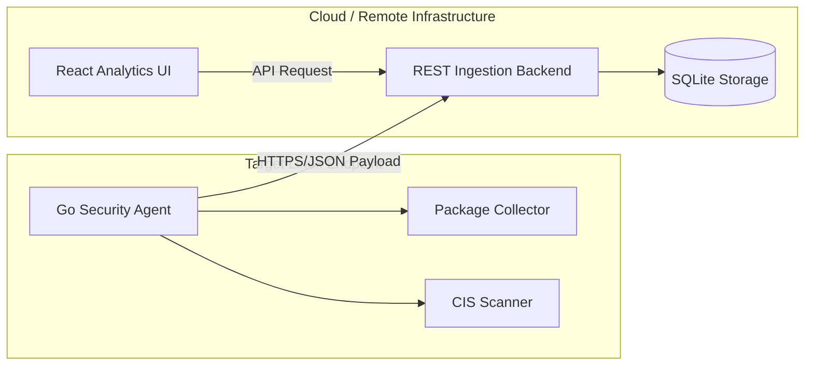

# Linux Cloud Security & Endpoint Auditing Framework

A comprehensive, production-ready Minimum Viable Product (MVP) for continuous security posture assessment. This suite features a lightweight Go agent auditing system policies against **CIS Benchmarks**, a secure REST ingestion layer, and a high-fidelity monitoring dashboard.

---

## 🛠️ Technology Stack
- **Edge Agent:** Go (Golang)
- **Central API Service:** Node.js (Express Framework)
- **Persistence Layer:** SQLite3 Database
- **Analytics Interface:** React.js + Vite (Custom CSS tokens)
- **Platform:** Linux (Tested natively on Ubuntu 22.04 LTS & AWS EC2)

---

## 🏗️ Architecture Design

> **Note on Architecture:** This project uses a custom Node.js backend with SQLite for streamlined local deployment and testing. In a full AWS production environment, this ingestion layer would be replaced by **AWS API Gateway** routing payloads to an **AWS Lambda** function, which would then persist the telemetry data into **Amazon DynamoDB**.



---

## 🚀 Step-by-Step Local Deployment & Execution

If testing locally on simulated environments, follow the modular startup guidelines.

### 1. Central API Node Setup
Responsible for listening to endpoint telemetry and mapping configurations.
```bash
cd backend
npm install
node server.js
```
*API accessible via: `http://localhost:5000`*

### 2. Frontend Analytics Interface Setup
Secure portal feeding continuous remediation protocols to administrators.
```bash
cd frontend
npm install
npm run dev
```
*Accessible via the printed Local Port.*

### 3. Go Agent Execution
To test the auditing flow against endpoint primitives manually:
```bash
cd agent
go run .
```

## 🔒 Security & Resilience
- **API Key Authentication:** The agent secures its communications using an `X-API-Key` header (`HG_API_KEY`).
- **Resilience Queue:** If the central API is unreachable, the agent queues payloads in-memory and retries them automatically.
- **Logging:** All agent activity is logged locally to `/var/log/hostguard-agent.log` (or `hostguard-agent.log` in the binary directory) alongside standard output.

---

## 📦 Automated .deb Packaging Workflow

To facilitate seamless DevOps rollout methodologies, build automated install scripts:

1. **Permission Allocation:**
   ```bash
   chmod +x build_deb.sh
   ```
2. **Standardized .deb Output:**
   ```bash
   ./build_deb.sh
   ```
3. **Rollout Deployment:**
   ```bash
   sudo apt install ./linux-security-agent_1.0.0_amd64.deb
   ```

---

## 🛡️ Security Checks Breakdown (12 Level-1 Controls)
- `PASS_MAX_DAYS` limits verification.
- Pam configurations for character complexity.
- Remote permission limits on root accounts.
- Firewall daemon enforcement.
- Internal timesync active mapping.
- Native threat analytics enablement (Auditd).
- Application sandboxing flags.
- Permission hierarchies.
- Visual display session checks.
- Authorized server notifications.
- **Unused Filesystems (cramfs) mounting disabled.**
- **Password reuse restrictions (pam_pwhistory).**

---

## 🔌 API Structure
The central Node.js API exposes the following endpoints for the frontend and agent:

- **`POST /api/ingest`**: Receives telemetry data (Host Info, Packages, CIS Results) from the Go agent. Requires `x-api-key` header.
- **`GET /api/hosts`**: Retrieves a list of all monitored hosts and their statuses.
- **`GET /api/hosts/:id`**: Retrieves metadata for a specific host.
- **`GET /api/hosts/:id/packages`**: Retrieves the software inventory for a specific host.
- **`GET /api/hosts/:id/cis-results`**: Retrieves the CIS benchmark audit results for a specific host.
- **`GET /api/dashboard/summary`**: Aggregates fleet-wide metrics (compliance score, totals, recent alerts) for the dashboard UI.
